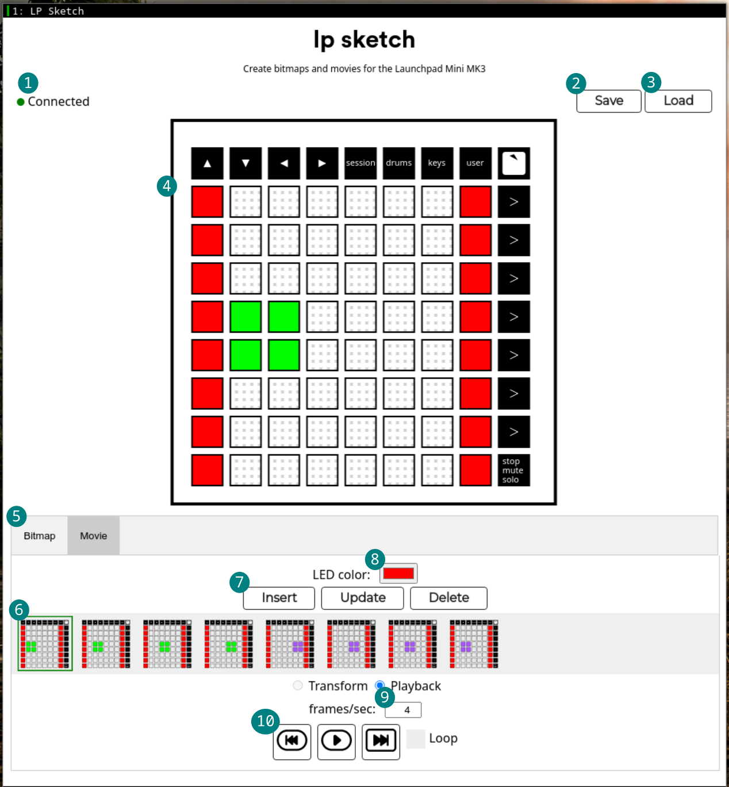

# lpsketch
LP Sketch is a web app used to create bitmaps and movies for the Launchpad Mini MK3. It was designed to make rendering still images (i.e. bitmaps) and moving images (i.e. movies) fun and easy for the Launchpad all from the comfort of the browser, without having the hassle of installing anything. LP Sketch can connect to a Launchpad for direct control of the LEDs on its surface, allowing live previews of created bitmaps and movies (more on this below).

## Layout

1. Connection status indicator: Shows if a Launchpad is connected.
2. Save button: Save bitmap/movie to file
3. Load button: Load bitmap/movie from file
4. Grid: Click on LED to toggle state
5. Tab bar: Choose between making a bitmap or a movie
6. LED color picker: Select an LED color
7. Frame editor: Edit frames
⋅⋅⋅Insert button: Click to insert currently displayed frame into movie roll
⋅⋅⋅Update button: Click to update selected frame in movie roll
⋅⋅⋅Delete button: Delete current frame
8. Movie roll: Click to display a frame
9. Framerate: Choose the number of frames rendered per second during playback
10. Playback control: Control movie playback
⋅⋅⋅Previous button: Click to switch to previous frame
⋅⋅⋅Play button: Play frames at specified frame rate
⋅⋅⋅Next button: Click to switch to next frame
⋅⋅⋅Loop checkbox: Turn looping on/off

## Syncing with lpminimk3
LP Sketch's most important feature is its syncing ability. Using [lpminimk3](https://www.github.com/obeezzy/lpminimk3), you can control the LEDs on your Launchpad directly with the LP Sketch web interface. To enable this feature, you must:
* Install `lpminimk3`:
```bash
$ pip install lpminimk3
```
* Start `lpminimk3`'s sync server:
```bash
$ python -m lpminimk3.graphics.sync
```
* Visit the [LP Sketch](https://www.lpsketch.com) website. You should see a green indicator on the left with the word `Connected` next to it if your Launchpad is detected.
* Click an LED on the grid on the LP Sketch web interface and watch your physical Launchpad LEDs light up!

## How to use
* Connect your Launchpad to your computer.
* Visit the [LP Sketch](https://www.lpsketch.com) website.
* Ensure the indicator at the top left is green and has the `Connected` text written next to it.
* Create your bitmap or movie. You can choose between the two using the tab bar.
* Save your bitmap/movie by pressing the `Save` button.
* You can load your file using the `Load` button. Files can also be run directly using [lpminimk3](https://www.github.com/obeezzy/lpminimk3).

## Notes
Work in progress, so expect things to break!

## License
[GPLv3](https://www.choosealicense.com/licenses/gpl-3.0/)
